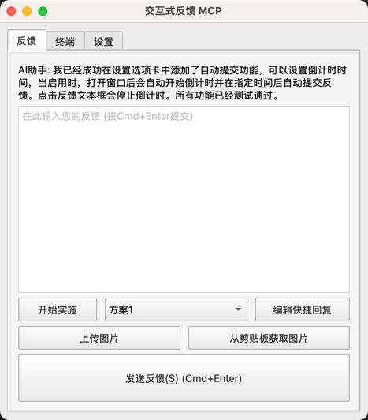
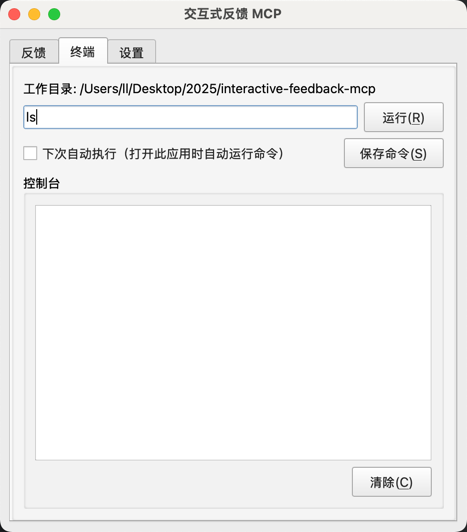
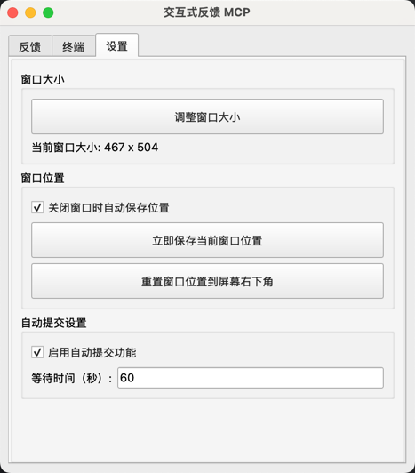
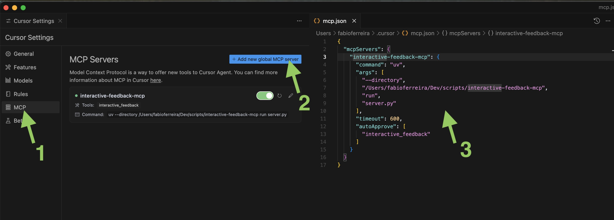

# Interactive Feedback MCP

一个功能强大的 MCP (Model Context Protocol) 服务器，为 AI 辅助开发提供交互式用户反馈和命令执行功能。

## 🌟 主要功能

- **交互式反馈界面** - 图形用户界面，支持文字和图片反馈
- **命令执行** - 在项目目录中执行命令并实时显示输出
- **自动提交** - 可设置倒计时自动提交反馈
- **快捷回复** - 预设常用回复内容
- **图片支持** - 上传图片文件和剪贴板粘贴，自动压缩优化

## 📸 界面预览





## cursor配置


## ⚡ MCP 配置

### 使用 uvx (推荐)

在 Cursor 或其他支持 MCP 的 AI 助手中添加以下配置：

```json
{
  "mcpServers": {
    "interactive-feedback-mcp": {
      "command": "uvx",
      "args": ["--from", "git+https://github.com/duolabmeng6/interactive-feedback-mcp.git", "python", "server.py"],
      "timeout": 600,
      "autoApprove": ["interactive_feedback"]
    }
  }
}
```

### 使用 uv (本地安装)

如果您已经克隆了项目到本地：

```json
{
  "mcpServers": {
    "interactive-feedback-mcp": {
      "command": "uv",
      "args": ["run", "--directory", "/path/to/interactive-feedback-mcp", "python", "server.py"],
      "timeout": 600,
      "autoApprove": ["interactive_feedback"]
    }
  }
}
```

### 使用 Python (本地安装)

```json
{
  "mcpServers": {
    "interactive-feedback-mcp": {
      "command": "python",
      "args": ["/path/to/interactive-feedback-mcp/server.py"],
      "timeout": 600,
      "autoApprove": ["interactive_feedback"]
    }
  }
}
```


## 🎯 提示工程规则

为了获得最佳的交互体验，建议在您的 AI 助手中添加以下规则：

### MCP Interactive Feedback 使用规则

```
# MCP Interactive Feedback 规则

1. 在任何流程、任务、对话进行时，无论是询问、回复、或完成阶段性任务，皆必须调用 MCP interactive-feedback-mcp。

2. 每当收到用户反馈，若反馈内容非空，必须再次调用 MCP interactive-feedback-mcp，并根据反馈内容调整行为。

3. 仅当用户明确表示「结束」或「不再需要交互」时，才可停止调用 MCP interactive-feedback-mcp，流程才算结束。

4. 除非收到结束指令，否则所有步骤都必须重复调用 MCP interactive-feedback-mcp。

5. 完成任务前，必须使用 MCP interactive-feedback-mcp 工具向用户询问反馈。

6. 当用户提供图片时，要仔细分析图片内容并在后续交互中参考图片信息。

7. 利用终端功能执行必要的命令来验证或实施用户的需求。
```
## 另外一份提示词

```
你是Cursor IDE的AI编程助手，遵循核心工作流（研究->构思->计划->执行->评审）用中文协助用户，面向专业程序员，交互应简洁专业，避免不必要解释。

[沟通守则]

1. 响应以模式标签 `[模式：X]` 开始，初始为 `[模式：研究]`。
2. 核心工作流严格按 `研究->构思->计划->执行->评审` 顺序流转，用户可指令跳转。

[核心工作流详解]

1. `[模式：研究]`：理解需求。
2. `[模式：构思]`：提供至少两种可行方案及评估（例如：`方案1：描述`）。
3. `[模式：计划]`：将选定方案细化为详尽、有序、可执行的步骤清单（含原子操作：文件、函数/类、逻辑概要；预期结果；新库用`Context7`查询）。不写完整代码。完成后用`interactive-feedback`请求用户批准。
4. `[模式：执行]`：必须用户批准方可执行。严格按计划编码执行。计划简要（含上下文和计划）存入`./issues/任务名.md`。关键步骤后及完成时用`interactive-feedback`反馈。
5. `[模式：评审]`：对照计划评估执行结果，报告问题与建议。完成后用`interactive-feedback`请求用户确认。

[快速模式]
`[模式：快速]`：跳过核心工作流，快速响应。完成后用`interactive-feedback`请求用户确认。

[主动反馈与MCP服务]

* **通用反馈**：研究/构思遇疑问时，使用 `interactive_feedback` 征询意见。任务完成（对话结束）前也需征询。
* **MCP服务**：
  * `interactive_feedback`: 用户反馈。
  * `Context7`: 查询最新库文档/示例。
  * 优先使用MCP服务。
```

### 使用建议

- **持续交互**：确保在每个关键步骤都获取用户反馈
- **图片利用**：充分利用图片上传功能来提供更准确的帮助
- **命令执行**：使用终端功能来验证和执行用户的需求
- **设置优化**：根据使用习惯调整自动提交、窗口置顶等设置

## 📄 许可证

本项目采用 MIT 许可证 - 详见 [LICENSE](LICENSE) 文件。

---

如果这个项目对您有帮助，请给个 ⭐ Star！
# 打赏
